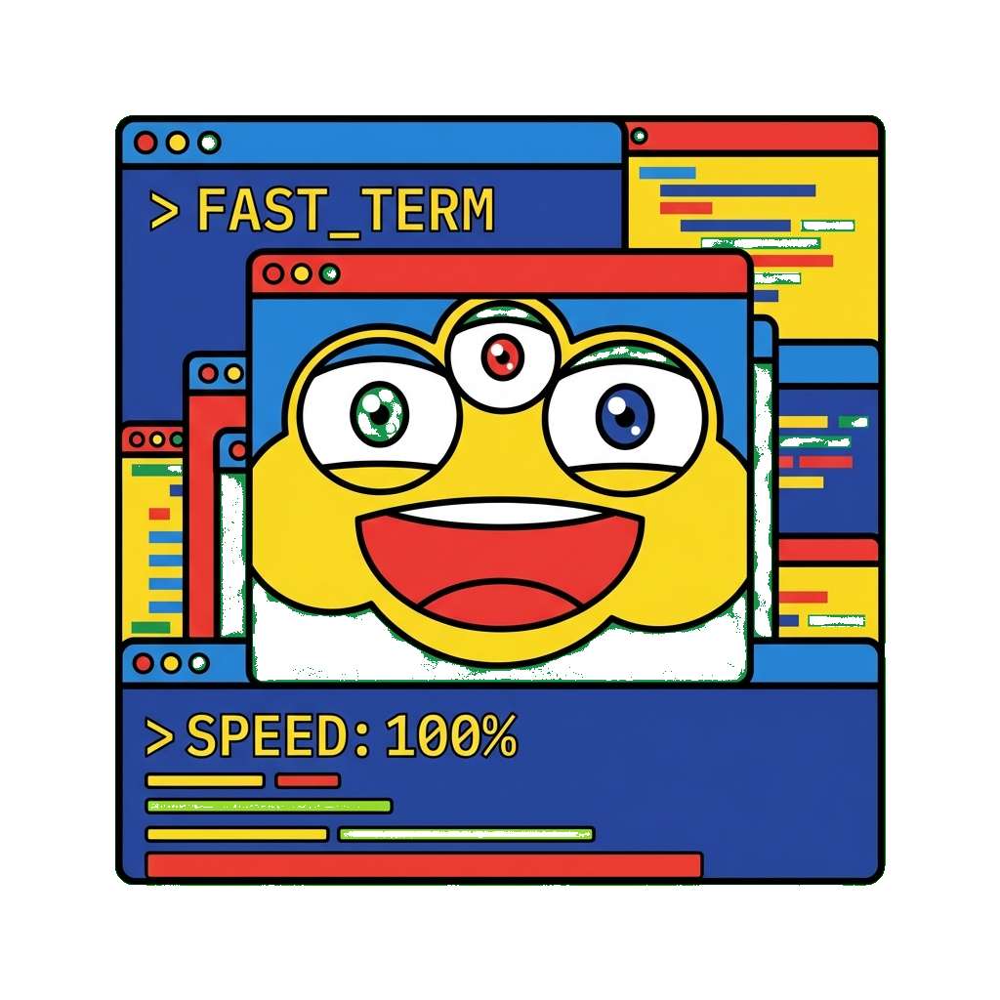

# Koi

A GPU-accelerated terminal emulator for macOS, built from scratch in Rust.

Built to understand GPU-accelerated real-time UI rendering at the systems level — instanced OpenGL, custom glyph atlas with subpixel LCD blending, sub-millisecond input handling.



<!-- TODO: Add screenshot of koi with split panes running different commands -->

## Features

- **GPU-rendered text** — instanced OpenGL with dual-source subpixel LCD anti-aliasing
- **Tabs** — Cmd+T new tab, Cmd+W close, Shift+[ / ] switch
- **Pane splitting** — binary tree layout with draggable dividers and click-to-focus
- **Scrollback** — 10,000 line history with trackpad/mouse wheel, snap-to-bottom on keypress
- **Selection** — click-drag with auto-scroll at pane edges, Cmd+C to copy, Cmd+V to paste
- **Mouse reporting** — SGR mouse protocol for vim, tmux, etc.
- **Font zoom** — Cmd+Plus / Cmd+Minus with live re-render
- **HiDPI** — Retina display support with proper DPI scaling
- **Dynamic glyph atlas** — auto-regrows from 2048 to 8192 when full (handles CJK, emoji, math)
- **Terminal emulation** — powered by alacritty_terminal

## Keybindings

| Key | Action |
|-----|--------|
| Cmd+T | New tab |
| Cmd+W | Close pane/tab |
| Shift+[ / ] | Previous/next tab |
| Cmd+D | Split pane vertically |
| Cmd+Shift+D | Split pane horizontally |
| Cmd+Opt+Arrow | Focus pane |
| Ctrl+Tab | Next pane |
| Cmd+Plus/Minus | Zoom font |
| Cmd+C | Copy selection |
| Cmd+V | Paste |
| Drag divider | Resize split panes |

## Architecture

```
winit EventLoop
       │
       ▼
   KoiState ─────────────────────────────────┐
   │  handle_keyboard()                      │
   │  handle_mouse_press/release/moved()     │
   │  handle_scroll()                        │
   │  render()                               │
   │                                         │
   ├──▶ TabManager                           │
   │    └── Tab[]                            │
   │        ├── PaneTree (binary tree)       │
   │        │   └── Node::Split { ratio }    │
   │        │       ├── left                 │
   │        │       └── right                │
   │        └── Pane (HashMap<id, Pane>)     │
   │            ├── Arc<FairMutex<Term>>  ◀──┤── Renderer reads
   │            └── Notifier ──▶ PTY thread  │      via lock
   │                                         │
   └──▶ Renderer                             │
        ├── GlyphCache                       │
        │   ├── Atlas (GL texture, regrows)  │
        │   └── HashMap<GlyphKey, Glyph>     │
        ├── TextRenderer (instanced quads)   │
        └── RectRenderer (backgrounds)       │
                                             │
PTY EventLoop (per pane, separate thread)    │
   └── reads shell output ──▶ Term ──────────┘
```

**Data flow:** winit events → KoiState dispatches to handlers → handlers lock Term via FairMutex, update state → render() reads Term state, builds glyph/rect instance batches → two GL draw calls per frame (rects then text with dual-source blending).

**Threading:** Main thread owns the GL context and all rendering. Each pane spawns a PTY thread that writes to `Term` through `FairMutex`. The lock is held briefly during render (read) and input forwarding (write).

## Build

Requires Rust toolchain and macOS (uses Core Text for font rasterization).

```bash
make build     # release build
make app       # build + assemble Koi.app bundle
make install   # build + install to /Applications
make clean     # cargo clean
```

## License

MIT
